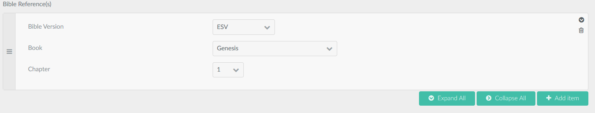

# Bibleref Plugin

The **Bibleref** Plugin is for [Grav CMS](http://github.com/getgrav/grav). It adds fields to the header (and admin form) for Bible references by version, book, and chapter.

## Installation

Installing the Bibleref plugin can be done in one of two ways. The GPM (Grav Package Manager) installation method enables you to quickly and easily install the plugin with a simple terminal command, while the manual method enables you to do so via a zip file.

### GPM Installation (Preferred)

The simplest way to install this plugin is via the [Grav Package Manager (GPM)](http://learn.getgrav.org/advanced/grav-gpm) through your system's terminal (also called the command line).  From the root of your Grav install type:

    bin/gpm install bibleref

This will install the Bibleref plugin into your `/user/plugins` directory within Grav. Its files can be found under `/your/site/grav/user/plugins/bibleref`.

### Manual Installation

To install this plugin, just download the zip version of this repository and unzip it under `/your/site/grav/user/plugins`. Then, rename the folder to `bibleref`. You can find these files on [GitHub](https://github.com/jeremy-gonyea/grav-plugin-bibleref) or via [GetGrav.org](http://getgrav.org/downloads/plugins#extras).

You should now have all the plugin files under

    /your/site/grav/user/plugins/bibleref
	
> NOTE: This plugin is a modular component for Grav which requires [Grav](http://github.com/getgrav/grav) and the [Error](https://github.com/getgrav/grav-plugin-error) and [Problems](https://github.com/getgrav/grav-plugin-problems) to operate.

## Configuration

Currently, there are no configuration options.

## Usage

### Adding a reference via Admin
Add the following code to your theme to add the fields to your content type 'TYPE':
```

  /**
   * Extend page blueprints with bibleref fields.
   *
   * @param Event $event
   */
  public function onBlueprintCreated(Event $event)
  {
    static $inEvent = false;

    /** @var Data\Blueprint $blueprint */
    $blueprint = $event['blueprint'];
    if (!$inEvent && $blueprint->getFilename() == 'TYPE') {
      $inEvent = true;
      $blueprints = new Data\Blueprints('user/plugins/bibleref/blueprints/');
      $extends = $blueprints->get('bibleref');
      $blueprint->extend($extends, true);
      $inEvent = false;
    }
  }
```
Add Bible references via the fields and save your content.


### Adding a reference via Markdown
Add a Bible references to header similar to below:
```
title: New Page Title
bible_references:
    -
        version: ESV
        book: Genesis
        chapter: '1'
    -
        version: KJV
        book: Matthew
        chapter: '1'
---
```
 
### Displaying references
To display all references on a page in your theme, use the following in your theme's template:

``

and the page will display a div with class "bible-references" containing urls to BibleGateway.com with the selected references.

## Credits

This project was inspired by Bible Field from Drupal found [here](https://www.drupal.org/project/bible_field).

## Known Issues
- Currently, the maximum available chapter defaults to 150 instead of following the actual maximum per book.

## To Do

- Add a default version to the plugin, but allow override per page.
- Add more available translation versions from BibleGateway.com.
- Follow the per-book max chapter rather than defaulting to the overall maximum of 150.
- Add verses to reference.
